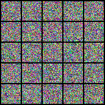

**Generative Modeling by Estimating Gradients of the Data Distribution implementation using PyTorch**

 

This paper proposed a generative model that estimates new samples using the gradients of $p_{data}(x)$ estimated by score-matching. The problem of inaccurate gradient estimation when the data exists in a low-dimensional manifold is solved by data perturbation with multiple levels of Gaussian. In addition, for sampling new data, the authors proposed annealed Langevin dynamics that uses gradients with small noise as it get closed to the data manifold.

 

 

- Trained CelebA dataset for 6500 iterations. Definitely need to train more to get better results.
