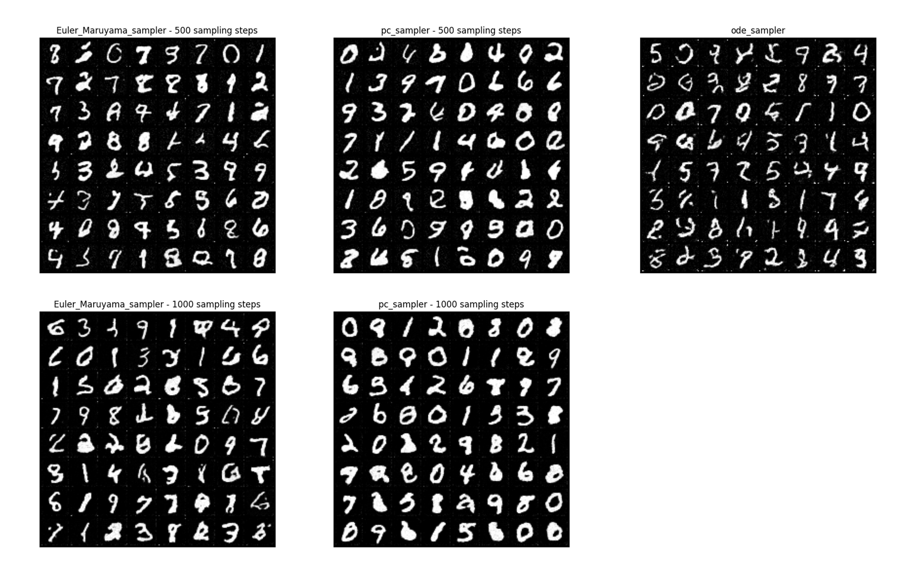

**Score-based generative model through stochastic differential equation**

 

NCSN에서 multiple noise $\sigma_i, i=1,2,...,L$ 를 더해주는 것이 score-based generative model 성능 향상의 핵심이었다. 본 논문에서는 이러한 noise scale의 크기를 $L \rightarrow \infin$로 일반화하여 high-quality sample, exact log-likelihood computation, inverse problem solving을 가능하게 했다. 

 

 

